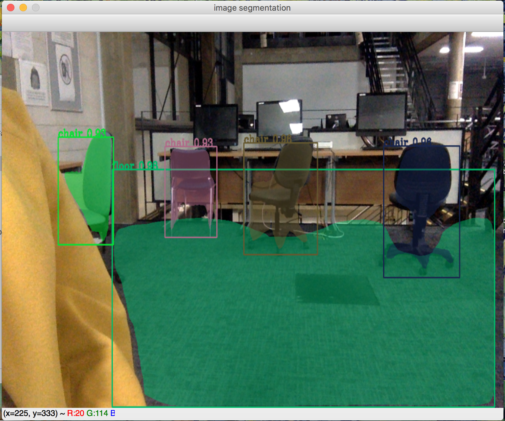

# Mask R-CNN for Image Segmentation of SUN RGB-D and NYU datasets

## Description

Tools in this repository are designed to allow a user to retrain Mask R-CNN model on SUN RGB-D or NYU dataset for image segmentation task with pre-trained COCO weights. This repository is a follow-up development of a project created for my master's thesis (see [here](https://github.com/hateful-kate/Mask_RCNN/blob/master/Master's_thesis.pdf)).

The library for these tools is based on Python implementation of Mask R-CNN by Waleed Abdulla, Matterport, Inc. (see [here](https://github.com/matterport/Mask_RCNN)). The model generates bounding boxes and segmentation masks for an object in the image. It's based on Feature Pyramid Network (FPN) and a ResNet101 backbone. 

The repository includes:
* Source code of Mask R-CNN built on FPN and ResNet101.
* Instruction and training code for the SUN RGB-D and NYU datasets.
* Pre-trained weights on MS COCO.
* Example of training on this datasets, with emphasize on adapting code to dataset with multiple classes.
* Jupyter notebooks to visualize the detection result.
* Integration with Kinect v2 and streaming video from webcam for image segmentation (super slow, but works).


## Usage
### Requirements
`Python 3.4`, `TensorFlow GPU 1.10.0`, `Keras 2.1.3` and other common packages listed in `requirements.txt`. For Kinect v2 integration, `pylibfreenect2` package and all dependencies are used, which might be installed from [here](https://github.com/r9y9/pylibfreenect2).

For reproducing the results, download pre-trained COCO weights (mask_rcnn_coco.h5) from the [releases page](https://github.com/matterport/Mask_RCNN/releases).
For training or testing the model, `pycocotools` package is required. Installation guide might be found [here]( https://github.com/cocodataset/cocoapi).

### Installation
It is developed under CentOS 7 with CUDA 9.0 and cuDNN v7.0.5. The program was mostly tested with Nvidia GeForce GTX 1080 Ti GPU.

```
git clone https://github.com/hateful-kate/Mask_RCNN.git
cd Mask_RCNN
mkdir datasets && cd datasets
wget http://rgbd.cs.princeton.edu/data/SUNRGBD.zip
unzip SUNRGBD.zip
rm SUNRGBD.zip
# if want to work with NYU dataset as separetelly
# mkdir NYU && cp -R SUNRGBD/kv1/NYUdata NYU
cd ..
pip3 install -r requirements.txt
```

### Getting Started
* [demo.ipynb](samples/demo.ipynb) Is the easiest way to start. It shows an example of using a model pre-trained on MS COCO to segment objects in your own images. It includes code to run object detection and instance segmentation on arbitrary images. The same as in original Mask RCNN repository.

* ([model.py](mrcnn/model.py), [utils.py](mrcnn/utils.py), [config.py](mrcnn/config.py)): These files contain the main Mask RCNN implementation. Model.py is changed to work with a multiclass classification.

* [Read_big_Matlab_file.ipynb](samples/sun/Read_big_Matlab_file.ipynb). This notebook reads the mapping file from SUNRGBD Toolbox from the [SUNRGBD Toolbox page](http://rgbd.cs.princeton.edu/), parse the annotation to json format and does mapping with the rest of the data. Requires downloading SUNRGB-D Toolbox and 64 GB of RAM to process the results provided in this repository.

* [Preprocess_dataset.ipynb](samples/sun/Preprocess_dataset.ipynb). This notebook creates the structure of dataset, parse the annotation to VGG format, does mapping to 13 or 37-40 classes and splits the data to train/val/test accordingly.

* [inspect_sun_data.ipynb](samples/sun/inspect_sun_data.ipynb). This notebook visualizes the different pre-processing steps
to prepare the training data.

* [inspect_sun_model.ipynb](samples/sun/inspect_sun_model.ipynb) This notebook goes in depth into the steps performed to detect and segment objects. It provides visualizations of every step of the pipeline as well as the mAP calculation for every IoU level.

* [inspect_sun_weights.ipynb](samples/sun/inspect_sun_weights.ipynb)
This notebooks inspects the weights of a trained model and looks for anomalies and odd patterns.

* [Segmentation_of_video.ipynb](Segmentation_of_video.ipynb)
This notebooks converts mp4 video to a video with an image segmentation on top.

* [Kinect_streaming_segmentation.ipynb](Kinect_streaming_segmentation.ipynb)
This notebooks uses Kinect v2 color channel for a video streaming with an image segmentation on top.

* [Image_segmentation_video_stream.ipynb](Image_segmentation_video_stream.ipynb)
This notebooks uses local camera to a video stream with an image segmentation on top.



# Training using pre-trained MS COCO weights
MS COCO weights are used as a starting point for training the model on SUN RGB-D and NYU datasets. Training and evaluation code is in `samples/sun/sun.py`. For reproducing the results you need to run all scripts from the `samples/sun` directory from the command line as such:

```
# Train a new model starting from pre-trained COCO weights
python3 samples/sun/sun.py train --dataset=/path/to/sun/or/nyu --model=coco

# Continue training a model that you had trained earlier
python3 samples/sun/sun.py train --dataset=/path/to/sun/or/nyu --model=/path/to/weights.h5

# Continue training the last model you trained. This will find
# the last trained weights in the model directory.
python3 samples/sun/sun.py train --dataset=/path/to/sun/or/nyu --model=last
```

The training schedule, learning rate, and other parameters should be set in `samples/sun/sun.py`.


## Differences from the Official Implementation
* **Mini-masks:** All mini-masks are removed.
* **Multi-threading:** Not alloved as it mostly slows down the whole system, because more resources are spent on administrative work, than on execution itself.
* **Learning Rate:** The paper uses a learning rate of 0.02, here they are changed to 0.001 for a better convergence without significant 
decrease in speed.


## License
Copyright (c) 2018 Ekaterina Lyapina. Contact me for commercial use (or rather any use that is not academic research) (email: ec16513 at qmul.ac.uk). Free for research use, as long as proper attribution is given and this copyright notice is retained.
