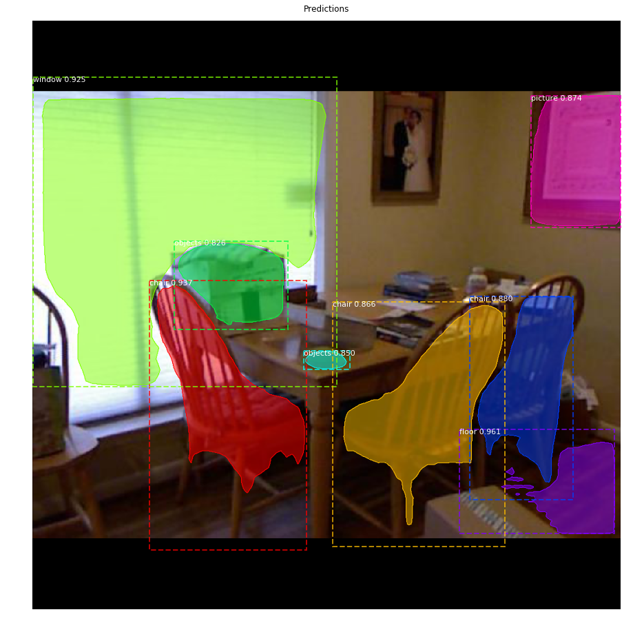

# Mask R-CNN for Image Segmentation of SUN RGB-D and NYU dataset

## Description

Tools in this repository are designed to allow the user to retrain Mask R-CNN model on SUN RGB-D or NYU dataset for image segmantation task with initial COCO weghts. This repository is a follow-up development of a project created for my master's thesis (see [here](https://github.com/hateful-kate/Mask_RCNN/blob/master/Master's_thesis.pdf)).

The library for these tools is based on Python implementation of Mask R-CNN by Waleed Abdulla, Matterport, Inc. (see [here](https://github.com/matterport/Mask_RCNN)). The model generates bounding boxes and segmentation masks for an object in the image. It's based on Feature Pyramid Network (FPN) and a ResNet101 backbone. 

This repository contains the details of implementation, which obtains a score of `[AP(IoU=0.5)=0.697]` for the SUN RGB-D dataset and `[AP(IoU=0.5)=0.1]` for NYU dataset.

The repository includes:
* Source code of Mask R-CNN built on FPN and ResNet101.
* Instruction and training code for the SUN RGB-D and NYU datasets.
* Pre-trained weights on MS COCO.
* Example of training on this datasets, with emphasize on adapting code to dataset with multiple classes.
* Jupyter notebooks to visualize the detection result.




## Usage
### Requirements
Python 3.4, TensorFlow GPU 1.10.0, Keras 2.1.3 and other common packages listed in `requirements.txt`.

For reprodusing the results, download pre-trained COCO weights (mask_rcnn_coco.h5) from the [releases page](https://github.com/matterport/Mask_RCNN/releases).
To training or testing the model, `pycocotools` package is required. Installation guide might be found [here]( https://github.com/cocodataset/cocoapi).

### Installation
It is developed under CentOS 7 with CUDA 9.0 and cuDNN v7.0.5. The program was mostly tested with Nvidia GeForce GTX 1080 Ti GPU.

```
git clone https://github.com/hateful-kate/Mask_RCNN.git
cd Mask_RCNN
mkdir datasets && cd datasets
wget http://rgbd.cs.princeton.edu/data/SUNRGBD.zip
unzip SUNRGBD.zip
rm SUNRGBD.zip
# if want to work with NYU dataset as separetelly
# mkdir NYU && cp -R SUNRGBD/kv1/NYUdata NYU
cd ..
pip3 install -r requirements.txt
```

### Getting Started
* [demo.ipynb](samples/demo.ipynb) Is the easiest way to start. It shows an example of using a model pre-trained on MS COCO to segment objects in your own images. It includes code to run object detection and instance segmentation on arbitrary images. The same as in initial Mask RCNN repository.

* ([model.py](mrcnn/model.py), [utils.py](mrcnn/utils.py), [config.py](mrcnn/config.py)): These files contain the main Mask RCNN implementation.  Model.py is changed to work with a multiclass classification.

* [Read_big_Matlab_file.ipynb](samples/sun/Read_big_Matlab_file.ipynb). This notebook reads the mapping file from SUNRGBD Toolbox from the [SUNRGBD Toolbox page](http://rgbd.cs.princeton.edu/), parse the annotation to json format and does mapping with the rest of the data. Requires downloading SUNRGB-D Toolbox and 64 GB of RAM to process the results provided in this repository.

* [Preprocess_dataset.ipynb](samples/sun/Preprocess_dataset.ipynb). This notebook creates the structure of dataset, parse the annotation to VGG format, does mapping to 13 or 37-40 classes and splits the data to train/val/test accordingly.

* [inspect_sun_data.ipynb](samples/sun/inspect_sun_data.ipynb). This notebook visualizes the different pre-processing steps
to prepare the training data.

* [inspect_sun_model.ipynb](samples/sun/inspect_sun_model.ipynb) This notebook goes in depth into the steps performed to detect and segment objects. It provides visualizations of every step of the pipeline as well as the mAP calculation for every IoU level.

* [inspect_sun_weights.ipynb](samples/sun/inspect_sun_weights.ipynb)
This notebooks inspects the weights of a trained model and looks for anomalies and odd patterns.


# Training using initial MS COCO weights
MS COCO weights are used as a starting point for trainin the model on SUN RGB-D and NYU datasets. Training and evaluation code is in `samples/sun/sun.py`. For peprodusing the results you need to run from the `samples/sun` directory from the command line as such:

```
# Train a new model starting from pre-trained COCO weights
python3 samples/sun/sun.py train --dataset=/path/to/sun/or/nyu --model=coco

# Continue training a model that you had trained earlier
python3 samples/sun/sun.py train --dataset=/path/to/sun/or/nyu --model=/path/to/weights.h5

# Continue training the last model you trained. This will find
# the last trained weights in the model directory.
python3 samples/sun/sun.py train --dataset=/path/to/sun/or/nyu --model=last
```

The training schedule, learning rate, and other parameters should be set in `samples/sun/sun.py`.


## Differences from the Official Implementation
This implementation follows the Mask RCNN paper for the most part, but there are a few cases where we deviated in favor of code simplicity and generalization. These are some of the differences we're aware of. If you encounter other differences, please do let us know.

* **Image Resizing:** To support training multiple images per batch we resize all images to the same size. For example, 1024x1024px on MS COCO. We preserve the aspect ratio, so if an image is not square we pad it with zeros. In the paper the resizing is done such that the smallest side is 800px and the largest is trimmed at 1000px.
* **Bounding Boxes**: Some datasets provide bounding boxes and some provide masks only. To support training on multiple datasets we opted to ignore the bounding boxes that come with the dataset and generate them on the fly instead. We pick the smallest box that encapsulates all the pixels of the mask as the bounding box. This simplifies the implementation and also makes it easy to apply image augmentations that would otherwise be harder to apply to bounding boxes, such as image rotation.
* **Learning Rate:** The paper uses a learning rate of 0.02, but we found that to be
too high, and often causes the weights to explode, especially when using a small batch
size. It might be related to differences between how Caffe and TensorFlow compute 
gradients (sum vs mean across batches and GPUs). Or, maybe the official model uses gradient
clipping to avoid this issue. We do use gradient clipping, but don't set it too aggressively.
We found that smaller learning rates converge faster anyway so we go with that.


